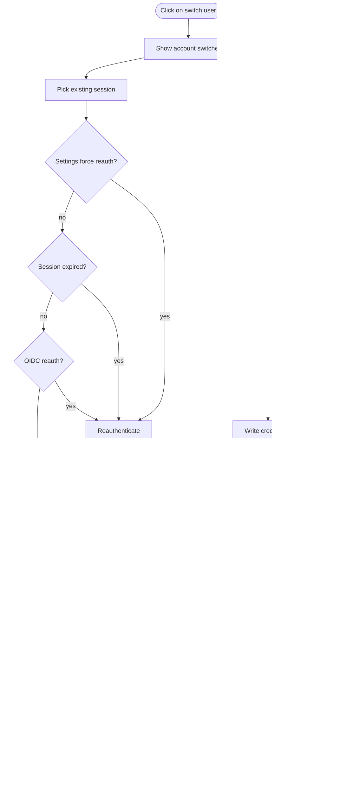

# Signin flowchart

## Case: no user is signed in

## Case: one user already signed in

## Case: multiple users already signed in

## Case: OIDC, no session

## Case: OIDC, one session

## Case: OIDC, multiple session

